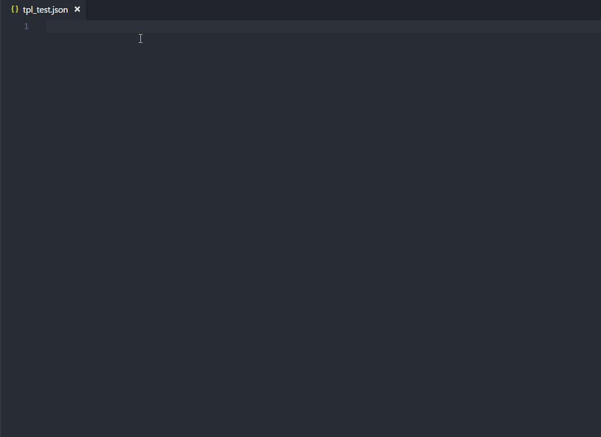

# JSON Schema for DBR Template Files
With JSON schema, you can use IntelliSense in **Visual Studio Code** when editing DBR template files.

## How to Use
1. Copy the file to workspace root.
2. Press **Ctrl+Shift+P** to open **User Setttings**.
3. Add the configuration:

    ```json
    "json.schemas": [
    {
        "fileMatch": [
            "/tpl_*.json"
        ],
        "url": "./dbr.json"
    }]
    ```
4. create template files named **tpl_*.json**.

    